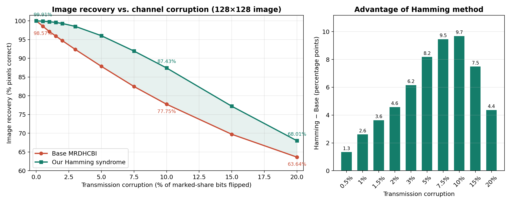

# Multi-Party Reversible Data Hiding in Ciphertext Binary Images

**IT429 – Number Theory and Cryptography · Course Project**
National Institute of Technology Karnataka (NITK), Surathkal
Guided by [Jaidhar C D](https://infotech.nitk.ac.in/faculty/jaidhar-c-d)

**Live demo:** https://jarvis0x07.github.io/MRDHCBI/

| Team member | Roll no. |
|---|---|
| Mubashir Afzal | 231AI021 |
| Hasini Jaishetty | 231AI012 |
| Kishora Shetty | 231AI014 |

---

## 1. What this project is

We implemented a multi-party reversible data hiding (RDH) scheme for **ciphertext binary images** and ran it as a browser demo. A binary image is encrypted into three shares with (2,3) visual cryptography (VC). A data hider then embeds a secret document into the shares. A receiver can extract the document and restore the shares, and any two restored shares reconstruct the original image exactly.

We compare two embedding methods:

- **Base MRDHCBI**: the baseline scheme, which embeds 1 payload bit per source pixel.
- **Our Hamming-syndrome method**: a variant we designed that embeds 3 payload bits per source pixel by encoding each VC block with Hamming(7,4) and hiding data in the syndrome state.

The project also includes an automated comparison against three published methods (Ren et al., Li et al., Zhang et al.) on six image categories, and a corruption experiment that flips random bits in the marked shares before transfer.

The whole demo runs in the browser. There is no backend, and the document is never uploaded anywhere.

---

## 2. How it works

### Pipeline

1. **Binarize.** The sender's image is thresholded: pixel ≥ 128 becomes 1, otherwise 0.
2. **VC encryption.** The (2,3) visual cryptography construction (B0/B1 basis matrices with random column permutations) turns the image into three ciphertext shares.
3. **Prepare the document.** The document is wrapped in a header and masked with a key-derived keystream (see section 5).
4. **Embed.** Each share is embedded with the payload bits:
   - *Base:* 1 bit per source pixel (3 stored bits per source pixel per share).
   - *Hamming syndrome:* 3 bits per source pixel, using the syndrome of a Hamming(7,4) codeword as the carrier (7 stored bits per source pixel per share).
5. **Transfer.** Only the three marked shares travel from sender to receiver. The document is not sent separately.
6. **Extract and restore.** The receiver extracts the payload, restores the original ciphertext shares, reconstructs the binary image from two restored shares, and verifies the document with CRC-32.

### Capacity and storage

| Metric | Base MRDHCBI | Our Hamming syndrome |
|---|---|---|
| Payload per source pixel | 1 bit | 3 bits |
| Stored bits per source pixel per share | 3 | 7 |
| Payload per stored bit | 1/3 | 3/7 |
| Stored bits vs. VC ciphertext | 3 (none added) | 7 (+133%, i.e. 7/3) |
| Capacity for a 128×128 image | 2 KB | 6 KB |
| Clean-channel image recovery | exact | exact |

Our method trades extra stored bits for three times the payload capacity. We do not claim it is better in every respect.

---

## 3. Using the demo

You need two browser tabs or two devices.

1. Open the site. Choose **Sender** in one tab and **Receiver** in the other.
2. Enter the same **pairing key** in both and press *Create pairing*. The sender opens the room first, then the receiver joins.
3. On the sender: choose a binary or grayscale image and the document to hide.
4. Optionally set the **transmission corruption** slider (0–20%). This flips random bits in the marked shares before transfer.
5. Press **Embed & send**.
6. The receiver shows the recovered image, the CRC-32 result, the recovered document (downloadable, with a text preview for `.txt` files), and a dashboard comparing the two methods.
7. **Analysis** on the landing page runs the five-method comparison locally. It needs no pairing, upload or connection.

> The document plus its header must fit in the capacity of the chosen image (about 6 KB for 128×128 with our method, about 2 KB with the base method). If the document only fits our method, the base column shows N/A.

---

## 4. Results

### 4.1 Corruption experiment

Setup: 128×128 binary image, 46-byte document (under 1% of our method's 6 KB capacity), one run per corruption level with fixed random seeds. "Corruption" is the percentage of marked-share bits flipped before transfer.

| Corruption | Base image recovery | Hamming image recovery | Gain (points) |
|---|---|---|---|
| 0% | 100.00% | 100.00% | 0.00 |
| 0.5% | 98.57% | 99.91% | 1.34 |
| 1% | 97.16% | 99.77% | 2.61 |
| 1.5% | 95.95% | 99.58% | 3.63 |
| 2% | 94.72% | 99.30% | 4.58 |
| 3% | 92.36% | 98.52% | 6.16 |
| 5% | 87.85% | 96.03% | 8.18 |
| 7.5% | 82.48% | 91.94% | 9.46 |
| 10% | 77.75% | 87.43% | 9.68 |
| 15% | 69.73% | 77.22% | 7.49 |
| 20% | 63.64% | 68.01% | 4.37 |



**Observations**

- With this small document, the Hamming method recovers more of the image than the base method at every non-zero corruption level.
- The reason is how the syndrome is used. Because the document fills under 1% of the capacity, almost every embedded syndrome symbol is 0. A flipped bit in a 7-bit block then produces a non-zero syndrome, which the receiver reads as an error position and flips back, so Hamming(7,4) acts as a single-error-correcting code. The base method has no such correction: a flip in either of the last two subpixels of a block makes the receiver also flip the first subpixel.
- The gain peaks at roughly 7.5–10% corruption (about 9.5–9.7 points) and shrinks at 15–20%, because blocks with two or more errors can no longer be corrected.
- **The advantage depends on how full the payload is.** When the syndrome carries payload bits, a channel error cannot be told apart from a payload symbol, so the correction is lost. Section 4.2 measures loads up to 25% of the Hamming capacity: the gain shrinks as the load grows but stays positive. A document that fills most of the capacity should show a smaller gain, or a loss against the base method. That case has not been measured on the site.
- **Document recovery was 0% for both methods from 0.5% corruption upward** (the base method reached 2.17% at 0.5%). The document sits in the first ~800 payload bits, and a single flipped bit there is enough to corrupt the header (so parsing fails or the body is misaligned) or the CRC. The dashboard reports 0% whenever parsing fails, even if most bytes arrived intact.

### 4.2 Effect of payload load

We repeated the corruption sweep with documents sized to 25%, 50% and 75% of the base method's capacity (2 KB for a 128×128 image): total payloads of 512, 1024 and 1536 bytes, which are 8.3%, 16.7% and 25% of the Hamming capacity. Same image, one run per point, same corruption levels. Entries are image recovery in % as Base / Hamming.

| Corruption | 25% load (480 B body) | 50% load (992 B body) | 75% load (1504 B body) |
|---|---|---|---|
| 0.5% | 98.57 / 99.77 | 98.61 / 99.60 | 98.65 / 99.38 |
| 1% | 97.16 / 99.50 | 97.22 / 99.13 | 97.29 / 98.77 |
| 2% | 94.70 / 98.83 | 94.82 / 98.12 | 94.98 / 97.61 |
| 2.5% | 93.55 / 98.28 | 93.68 / 97.51 | 93.86 / 96.88 |
| 5% | 87.85 / 95.15 | 88.07 / 93.98 | 88.32 / 92.82 |
| 7.5% | 82.48 / 90.92 | 82.77 / 89.46 | 83.06 / 88.40 |
| 10% | 77.76 / 86.36 | 78.08 / 84.89 | 78.49 / 83.62 |
| 15% | 69.74 / 76.51 | 70.06 / 75.33 | 70.54 / 74.27 |
| 20% | 63.62 / 67.72 | 63.89 / 66.91 | 64.42 / 66.44 |


**Observations**

- The Hamming method recovers more of the image than the base method at every corruption level and at all three loads.
- The base method barely depends on the load. Its three columns agree to within about 0.8 points at each corruption level.
- The Hamming method's advantage shrinks as the load grows, because payload bits in the syndrome stop a channel error from being located. At 5% corruption the gain is 7.3, 5.9 and 4.5 points at 25%, 50% and 75% load; at 10% it is 8.6, 6.8 and 5.1; at 20% it is 4.1, 3.0 and 2.0.
- Document recovery was 0% for both methods at every corruption level and every load, apart from one chance match for the base method (0.42% at 1% corruption, 25% load).
- The 0% corruption point is not shown here. The clean-channel result was exact in the earlier runs.

### 4.3 Comparison with published methods (Analysis tab)

The Analysis tab evaluates five methods on six categories named after the paper's test images (Cartoon, CAD, Texture, Mask, Pattern, Document):

- Ren et al. [12], Li et al. [13], Zhang et al. [14]: our reference implementations of the published mechanisms.
- Base MRDHCBI and our Hamming method: the project's own implementations.

Every number in the tables is measured by running the code in the browser. No published benchmark figure is copied in. It reports embedding rate (bpp), payload capacity, runtime, exact recovery, and embedding-rate stability across categories.

---

## 5. Document format and masking

Before embedding, the browser builds this byte stream:

```
[name length : 2 bytes]
[mime length : 2 bytes]
[file size   : 4 bytes]
[CRC-32      : 4 bytes]
[file name]
[MIME type]
[file bytes]
```

The whole stream is XORed with a keystream generated from the pairing key using SHA-256 in counter mode, then converted to payload bits. This is a reversible demonstration format. It is not authenticated encryption and should not be used to protect real data.

---

## 6. Project structure

```
.
├── index.html          page markup, loads PeerJS and Chart.js from CDNs
├── styles.css          light and dark themes, layout
├── js/
│   ├── algorithm.js    VC, base embedding, Hamming(7,4) syndrome embedding,
│   │                   extraction/restoration, payload masking, CRC-32,
│   │                   reference implementations of Ren/Li/Zhang
│   └── app-v6.js       UI, PeerJS pairing, transaction flow, dashboard, analysis
├── docs/
│   └── base_vs_hamming_recovery.png
└── README.md
```

External dependencies (loaded from CDNs):

- PeerJS 1.5.4, for WebRTC signalling and data channels.
- Chart.js 4.4.7, for the charts.

If you change `js/app-v6.js` or `js/algorithm.js`, bump the `?v=` query string on the matching `<script>` tags in `index.html`. Otherwise browsers may keep serving a cached copy.

---

## 7. Running it

### GitHub Pages

The site is static. Push to `main` and enable *Settings → Pages → Deploy from a branch → main / (root)*.

### Locally

```bash
git clone https://github.com/Jarvis0x07/MRDHCBI.git
cd MRDHCBI
python3 -m http.server 8000
# open http://localhost:8000
```

Pairing needs internet access, because the two browsers find each other through the public PeerJS signalling server. The shares themselves go directly between browsers over a WebRTC data channel.

---

## 8. Limitations

- **Document survival under noise:** the document did not survive any corruption of 0.5% or more (see 4.1). Both methods are meant for reversible hiding on a clean channel. They are not noise-robust document carriers.
- **Payload fill:** the image-recovery advantage of the Hamming method was measured up to a document using 25% of its capacity (75% of the base capacity). It shrinks as the load grows (see 4.2) and is expected to shrink further, or reverse, as the payload fills the syndrome space. Near-full loads were not measured.
- **One payload, three shares:** in the demo the same payload bits are embedded into all three shares, and the receiver extracts the document from the first share only. It is not independent embedding by three different data hiders.
- **Receiver image recovery:** the receiver cannot see the original image, so its "image recovery" figure is the one the sender computed and put in the manifest. The recovered image itself is reconstructed on the receiver.
- **Single runs:** each corruption level was run once with fixed seeds. We did not average over seeds.
- **Replica test images:** the exact BMP files named in the paper were not available, so the six Analysis inputs are deterministic binary replicas of each category. Absolute numbers will differ from the paper.
- **Reference implementations:** Ren, Li and Zhang are our own implementations of the published mechanisms with fixed parameters. They are not the authors' code. Runtimes come from the browser, not the paper's MATLAB setup.
- **Pairing key:** it identifies the room and seeds the payload mask. It is not a secure key exchange, and the public PeerJS broker is third-party infrastructure. For anything beyond a demo, run your own signalling server and use authenticated encryption.
- **Scope:** this is a course-project demonstrator, not a production file-transfer tool.

---


© 2026 MRDHCBI Project Team · IT429, NITK Surathkal
